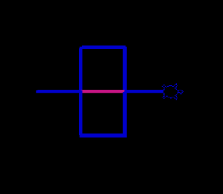
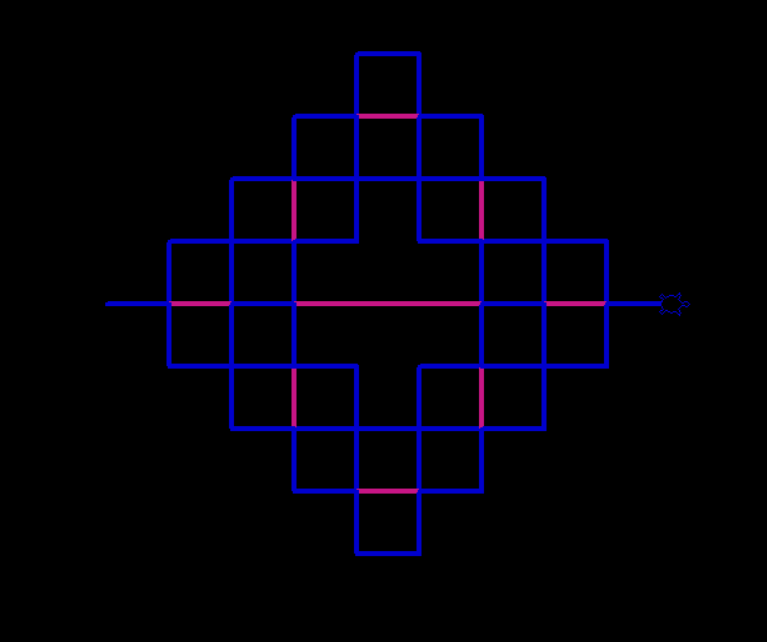
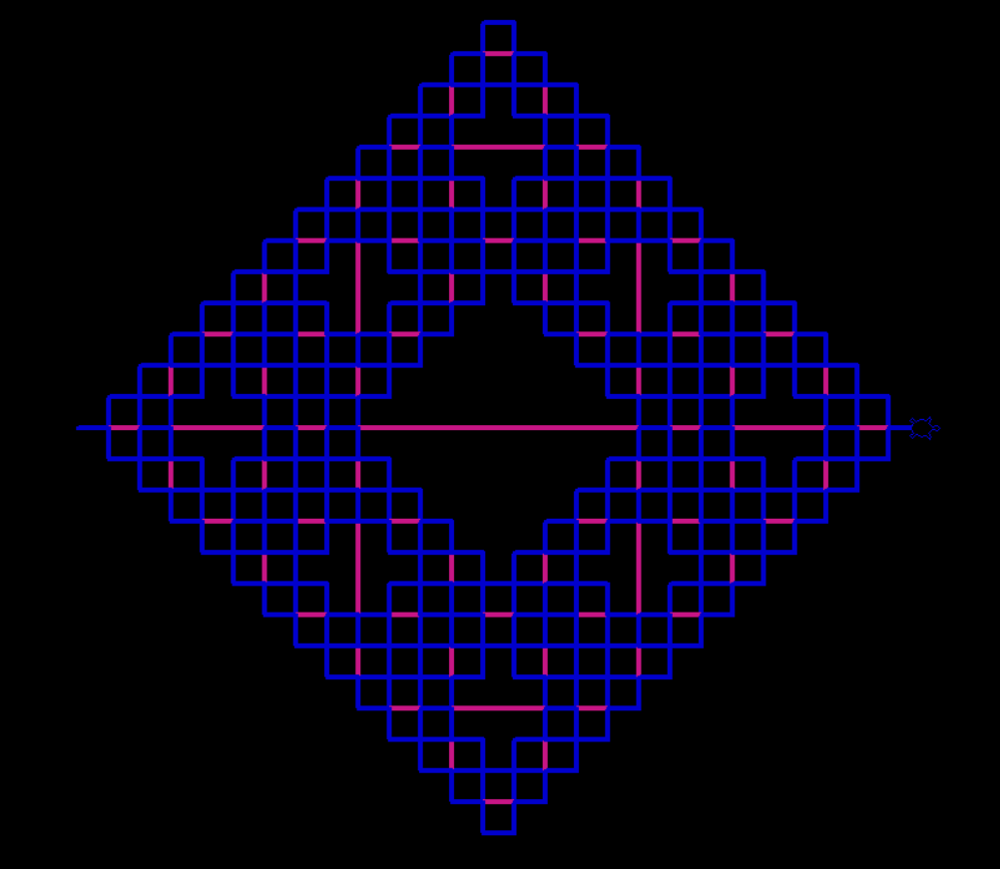
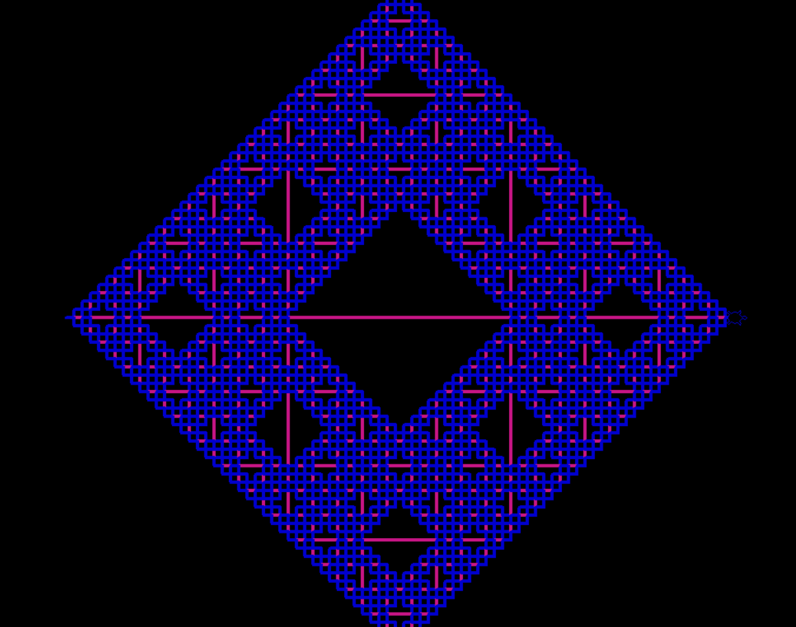

# Embaldosado de Sierpinski

Creando el Embaldosado de Sierpinski con Expresiones Regulares


Una vez ejecutado el "2LSystem.exe" se abrira la consola de mando y otra ventana donde se dibujara
en la consola indicaremos las veces que la tortuga itere
en la consola mostrara la regla de produccion que se genero y posteriormente comenzara a dibujar el ensambrado.

 https://github.com/cozakoo/Python_EmbaldosadoSierpinski/assets/107519498/54fc61a3-33fa-4107-8f9b-5b80c9a8ace3

|  |  |
|------------------------------------------------|------------------------------------------------|
|  |  |


## Instalar
```bash
git clone https://github.com/cozakoo/ER-EmbaldosadoSierpinski.git

python -m venv <venv>

source <venv>/Scripts/activate
  
cd ER-EmbaldosadoSierpinski
en la consola indicar el numero de iteraciones
Ingrese el numero de iteraciones: <numero_interacciones>
python 2LSystem.py

```
### Activar venv
  
| Platform | Shell           | Command to activate virtual environment |
| -------- | --------------- | --------------------------------------- |
| POSIX    | bash/zsh        | $ source <venv>/bin/activate            |
|          | fish            | $ source <venv>/bin/activate.fish       |
|          | csh/tcsh        | $ source <venv>/bin/activate.csh        |
|          | PowerShell Core | $ <venv>/bin/Activate.ps1               |
| Windows  | cmd.exe         | C:\> <venv>\Scripts\activate.bat        |
|          | PowerShell      | PS C:\> <venv>\Scripts\Activate.ps1     |

## Explicación
    No terminales: F G
    Terminales: + −
    Cadena Inicial: F
    Reglas de producción :  (F→F+F-F-F-G+F+F+F-F)
                            (G → GGG)
    Angulo : 90°
    Interpretación:
        F: Dibujar Segmento
        +: Girar a la Izquierda
        -: Girar a la Derecha
